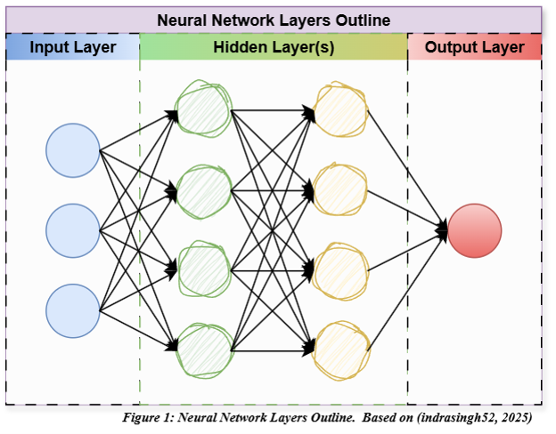
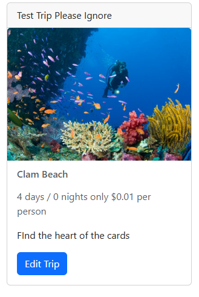
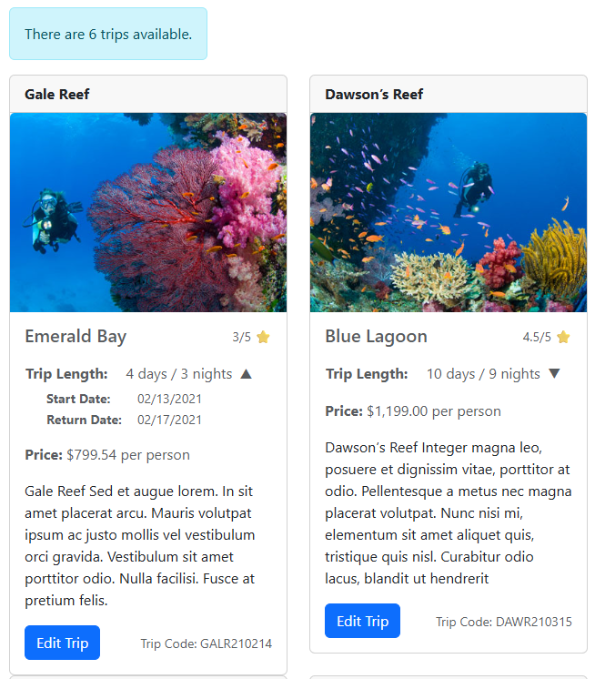
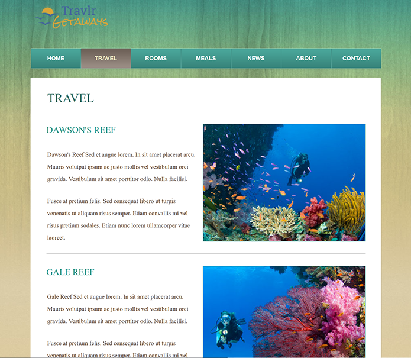
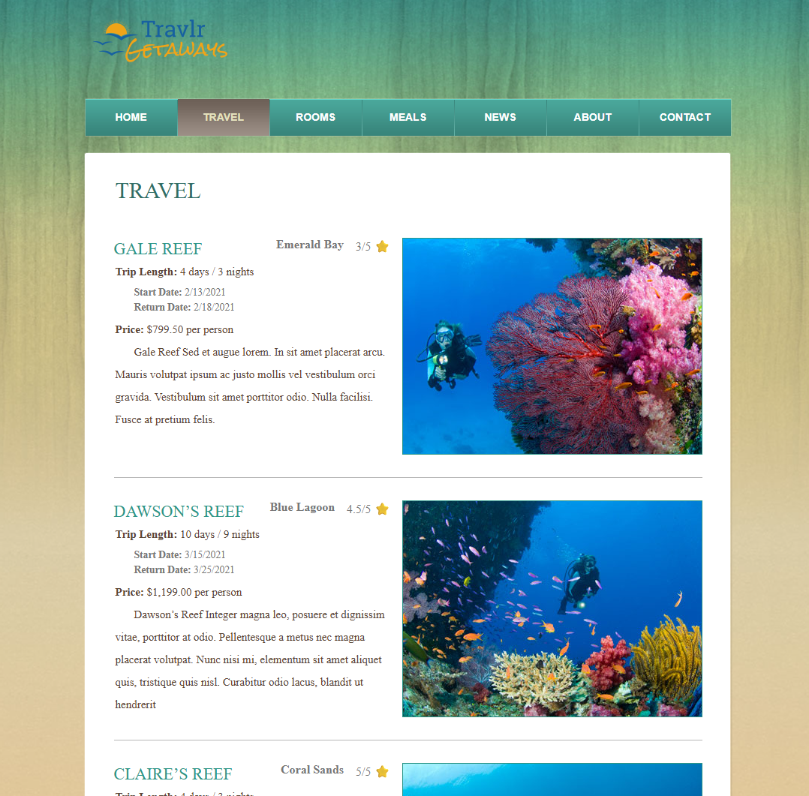

# Robert S Bell's ePortfolio

## Introduction
Good day to you, my name is Robert Bell, I have a BS in Biology with a Math minor and started my Computer Science degree at Hillsborough Community College in 2021 before transferring to SNHU's program in 2023.

## Self-Assessment
#### Foundation
Between the two programs I have developed a particularly broad foundation in software development and developed the skills needed to tackle highly advanced projects as well as the foundation and flexibility required to pick up new skills as needed.  I have worked in all of the standard programming languages though I have also tackled niche languages like COBOL in addition to getting experience porting software from one language to another.  I have worked in a dozen different development environments and with wide range of development tools.

#### Data Structures and Algorithms
The two programs have taken me from basic data structures and algorithms to far more advanced ones and working on projects such as the K-9 rescue center database and smart thermostat have frequently inspired me in developing ever more creative and robust data structures and algorithms.

#### Software Engineering and Databases
I have spent a great deal of time working with databases: working in MySQL, MongoDB, and SQLite. Producing CRUD interfaces in several languages and circumstances.  Finding a lot of fun in improving the utility of the data types suggested by a given assignment and developing idiot proof verification steps to prevent non-sensical or invalid data being inserted.  I've developed applications for multiple targets from web apps, to windows/linux native apps, to firmware for embedded systems, to android apps.  Some of which were full stack applications making full use of those databases.

#### Security and Encryption
I've studied security and encryption as much as anything else throughout the program.  From a legal/regulatory perspective, such as the encryption standards required for protected health information.  Studied GDPR compliance and the CIA Triad; Developing, implementing, and enforcing security polices; core security principles; protecting against SQL Injection attacks; Layering and isolating critical components; Key management and authentication practices, which I used in the login page included as part of one of my artifacts; as well as penetration testing tools and techniques.

#### Communication, Collaboration, and Stakeholders
In the program I have learned a great deal about communication with stakeholders and adapting my explanations to my audience as well as how to collaborate and code with collaboration in mind.  I have also grown comfortable with developing diagrams for communicating with coworkers and stakeholders alike.  Creating complex state machine diagrams and simple visual illustrations.  Adding to my existing prowess in image creation and editing in Photoshop, [3D Printing examples and prototypes](https://youtube.com/shorts/anTQoj7xrd8?feature=share), and video editing in DaVinci Resolve I am skilled in many visual means of presentation.

## [Casual Code Review](https://youtu.be/U2nA5Dp6yIw) (YouTube Link)

## [Narrative Milestones Collection](/Narrative%20Milestones/)

## Artifact 1 - Thermostat
This artifact comes from my embedded systems code for my thermostat project in CS 350.  It was a “smart” thermostat, intended for a hypothetical unified heating and cooling system.  It would alternate between showing the current temperature and the set temperature.  It uses indicator lights to show when it was above or below the set temperature.  It provides a user interface of three physical buttons, one button would change the states between heating, cooling, and off, another button would adjust the desired temperature downwards and the other upwards.  It displays the date and time.  It was created in the middle of 2025.

#### Why I Picked It
I selected this item because I was unsatisfied with the original assignment.  The original was a piece of software running in an Ubuntu environment on an expensive SBC with specs comparable to an old desktop.  I wanted to create a truly embedded system running on a more realistic board.  The unaltered artifact demonstrates my ability to manage CPU threading in code and develop specific hardware components, make conversions between variable types and units as needed, as well as using innovative techniques to produce the best results such as using custom bitmaps to better convey visuals.  My alterations demonstrate my ability to port code to new languages and hardware, to develop software for embedded systems and adapt to different components, as well as flexible problem-solving ability.

#### The Enhancements I Made
I improved the artifact first by porting it from python running within Ubuntu on a Raspberry Pi 4 to running compiled in C++ on an Arduino UNO R4.  The other improvements arising from porting over all the features that were “cheated” by having a typical operating system to reference in the original code.  The original code took date and time from the operating system.  I added code to connect to the user’s router, query NTP to get UTC time and then query ipapi.co for the locale/timezone of the user’s public IP address.  Once discovered the device’s built-in clock takes over so a stable internet connection is not required, it checks once every 24 hours in case of a time change.  I also added the ability to display the temperature in both Fahrenheit and Celsius using the R4’s built in LED dot matrix display in addition to the LCD 16x2 character display.
In the second round of enhancements, I set the LCD display to show the current temp for 10 seconds and the set temp for 5 seconds in cycles but whenever the temperature is changed with a button press the set temp is displayed for the next 5 seconds so the user can see what they’re working on.  I reworked the LED dot matrix display function to display current temp except for 5 seconds after the set temp has been changed using the previous code.  I fixed a bug where the pulsing of LED lights would reset when temperature was changed.
In the third round of enhancements, I put a great deal of work into the display redefining things for the most attractive look.  The date now displays as “Aug 23rd” instead of “Aug 23” with a function added to change the suffix based on the day.  I added the ability to display time according to a 12 hour clock “7:58AM” instead of  “07:58:05”.  So the first line reads “Aug 23rd  7:58PM” instead of “Aug 23 07:58:05”.  I added multiple functions to the green state button: pressing the button changes the states normally, however holding the button down for 3 seconds switches between displaying 12 hour time and military time.  The military time now displays as  “Aug 23rd  07:58”.
If I were to make further updates, I’d like to hook it to a heater and AC and give it control of both.  I’d also like to add a energy saving mode.

#### Visual Examples
##### [Original implementation written in python running on Raspberry Pi in Ubuntu](https://youtu.be/t8UX5NL1YPQ)

##### [Current implementation re-written and enhanced in C++ running natively on Arduino Uno R4 Wifi](https://youtu.be/ZPn_nUhVgnc)

#### Brief Reflection
I learned a lot about working with sensors and developing software that spoke directly to the circuitry I designed.  In porting the software I encountered a few challenges that I mostly outlined above. The temperature sensor I had originally designed for was lost sometime last year, so I needed to replace it with another one with a different interface.  Moreover, I needed to recreate features that are simple within a desktop environment that are more difficult within an embedded system.

## Artifact 2 - Full Stack Travel Agency Website
The artifact is my final project for CS-465 Full-Stack Development.  It represents a Travel agency website and associated database produced through the MEAN stack with an Angular interface for administrators to manage the database of all available trips.

#### Why I Picked It
I selected this item because full-stack developers and web developers are continually in high demand and such a vast project necessarily demonstrates a wide range of skills.  Such as converting static HTML into dynamic handlebars pages, properly coding a login screen, properly implementing a database, effective use of data types within a database, implementation of CRUD, an Angular interface for managing said database and CRUD operations, and proper authentication.

#### The Enhancements I Made
In the first round of improvements the artifact was improved by conducting a thorough code review targeting any bugs or errors that arose but primarily addressing professional style, formatting, and consistency.  In this endeavor I formatted and added additional commentary to 20 different pages.  I removed all files and numerous portions of code created during testing that are not used in the final implementation.  I discovered and fixed several errors.  Security tokens are properly implemented.
During the second round of enhancements, I focused on improving trip schema which models the trip database entries used by the angular admin page and the website page “travel.hbs”.  I modified the trip-cards to display more useful information on the admin page and modified travel.hbs to display more information more cleanly.  Expanded upon what information was viewable only while logged in.  Modified the add and edit trip pages/modules to include real time validation of each field with useful feedback.  Added the end (Date) field.  Admins can now either enter the length of stay and the start date to generate the end date or they can enter start date and the end date to generate the length of stay.  The edit/add pages dynamically gray out the other field when the other is filled in.
During the third round of enhancements, I added a function to pages to display a placeholder image in the event the image filename specified could not be found.

#### Visual Examples (Before and After)

##### Admin Cards Before Enhancement.

##### Admin Cards After Enhancement.

##### Travel Page Before Enhancement.

##### Travel Page After Enhancement.

#### Brief Reflection
Web development has trended towards being an avenue where I am weaker, I faced numerous challenges updating the implementation from what was described in the assignment to the modern angular framework but in doing so I developed a great deal more comfort working in the MEAN stack, working with servers, and user login/registration.  Getting everything to work as intended in such a large project proved quite difficult but very rewarding in experience.
